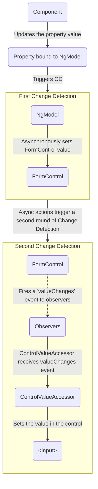

# Forms in Angular

**Summary:** This file covers topics related to "Forms in Angular". Key snippets include: Implementing Reactive Form Control in Angular TypeScript, Testing View-to-Model Data Flow in Reactive Forms, Visualizing Model-to-View Data Flow in Template-Driven Forms, Testing Model to View Data Flow in Angular Template-Driven Forms, Implementing Template-Driven Form Control in Angular TypeScript.

---

## Implementing Reactive Form Control in Angular TypeScript

**Description:** This snippet demonstrates how to set up a reactive form control for a favorite color input field in an Angular component. It shows the creation of a FormControl instance and its connection to the template using formControlName.

```typescript
import { Component } from '@angular/core';
import { FormControl } from '@angular/forms';

@Component({
  selector: 'app-favorite-color',
  template: '<input type="text" [formControl]="favoriteColorControl">'
})
export class FavoriteColorComponent {
  favoriteColorControl = new FormControl('');
}
```

---

## Testing View-to-Model Data Flow in Reactive Forms

**Description:** This TypeScript code demonstrates how to test the view-to-model data flow in reactive forms. It simulates user input and verifies that the form control value is updated correctly.

```typescript
it('should update the value of the input field', () => {
  const input = fixture.nativeElement.querySelector('input');
  const event = new Event('input');

  input.value = 'Red';
  input.dispatchEvent(event);

  expect(component.favoriteColorControl.value).toEqual('Red');
});
```

---

## Visualizing Model-to-View Data Flow in Template-Driven Forms

**Description:** This diagram shows how data flows from the model to the view when a property changes in template-driven forms, demonstrating the change detection process and async operations.



---

## Testing Model to View Data Flow in Angular Template-Driven Forms

**Description:** This test verifies that changes to the component model are properly reflected in the view. It updates the component's favoriteColor property and checks if the input field displays the updated value.

```TypeScript
it('should update the value in the control', fakeAsync(() => {
  component.favoriteColor = 'Blue';

  fixture.detectChanges();

  tick();

  const input = fixture.nativeElement.querySelector('input');

  expect(input.value).toBe('Blue');
}));
```

---

## Implementing Template-Driven Form Control in Angular TypeScript

**Description:** This snippet shows how to set up a template-driven form control for a favorite color input field in an Angular component. It uses ngModel to create an implicit FormControl instance managed by Angular.

```typescript
import { Component } from '@angular/core';

@Component({
  selector: 'app-favorite-color',
  template: '<input type="text" [(ngModel)]="favoriteColor">'
})
export class FavoriteColorComponent {
  favoriteColor = '';
}
```

---